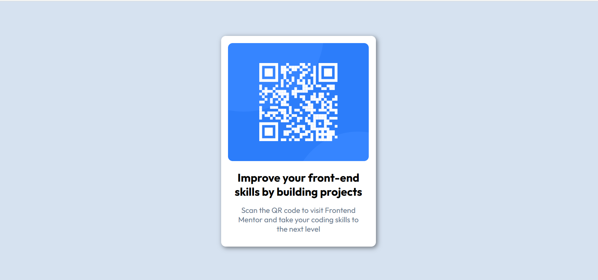

# Frontend Mentor - QR code component solution

This is a solution to the [QR code component challenge on Frontend Mentor](https://www.frontendmentor.io/challenges/qr-code-component-iux_sIO_H). Frontend Mentor challenges help you improve your coding skills by building realistic projects. 

## Table of contents

- [Overview](#overview)
  - [Screenshot](#screenshot)
  - [Links](#links)
- [My process](#my-process)
  - [Built with](#built-with)
  - [What I learned](#what-i-learned)
  - [Continued development](#continued-development)
  - [Useful resources](#useful-resources)
- [Author](#author)

## Overview

### Screenshot



### Links

- Solution URL: [Add solution URL here](https://your-solution-url.com)
- Live Site URL: [Add live site URL here](https://your-live-site-url.com)

## My process

### Built with

- Semantic HTML5 markup
- CSS custom properties
- Flexbox

### What I learned

Flex-basis es una propiedad que nos ayuda a dar una base de ancho o alto al elemento dependiendo de la direccion del main-axis. 

If we have a code like the following:

```html
<article class="container">
  <figure class="figure">
    
  </figure>
  <div class="texts">...</div>  
</article>
```
```css
.container{
  display: flex;
  flex-direction: column;
  .
  .
}
.figure{
  flex-basis: 45%;
}
.picture{
  width: 100%;
  height: 100%;
}
```

We probably think that the image takes up 100% of the height, but the truth is that this does not happen. The image does not respect the height of its parent.

I was able to discover two ways to solve this problem.

1. Set the image as background in the picture tag.
2. Give the figure tag a defined height and use the justify-content or align-content properties.

I used the 2nd option.

### Continued development

I would like continue to work with the flex-box property.  

Especially working with the properties:
- Flex-basis: A base width or height for an element
- Flex-grow: How to enlarge elements
- Flex-shrink: How elements shrink

I would like also continue improving responsive design

### Useful resources

- [Example resource 1](https://ed.team/blog/guia-definitiva-de-flexbox-2-flex-basis-flex-frow-flex-shrink) - This article helped me remember how the 3 main properties of flex-box work

## Author

- Website - [Osvaldo Valdivia](#)
- Frontend Mentor - [Osvaldo Valdivia](https://www.frontendmentor.io?ref=challenge)

